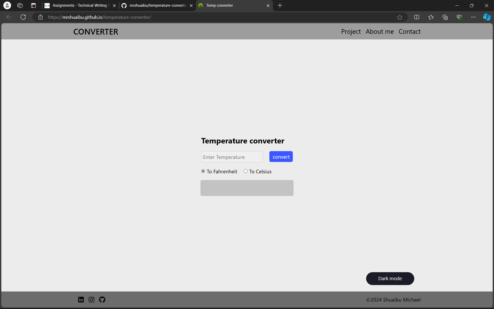

## Introduction
The Temperature Converter is a simple web application that allows users to 
convert temperatures between Celsius and Fahrenheit. 

## Features
- **Temperature Conversion**: Convert temperatures from Celsius to Fahrenheit 
and vice versa.
- **Responsive Design**: The application is responsive and works well on both 
desktop and mobile devices.
- **Dark Mode**: A toggle button allows users to switch between light and dark 
modes for a better viewing experience.
- **User-Friendly Interface**: Simple and intuitive layout for easy navigation.

## Screenshot

*This is my temperature converter*

## Technologies Used

